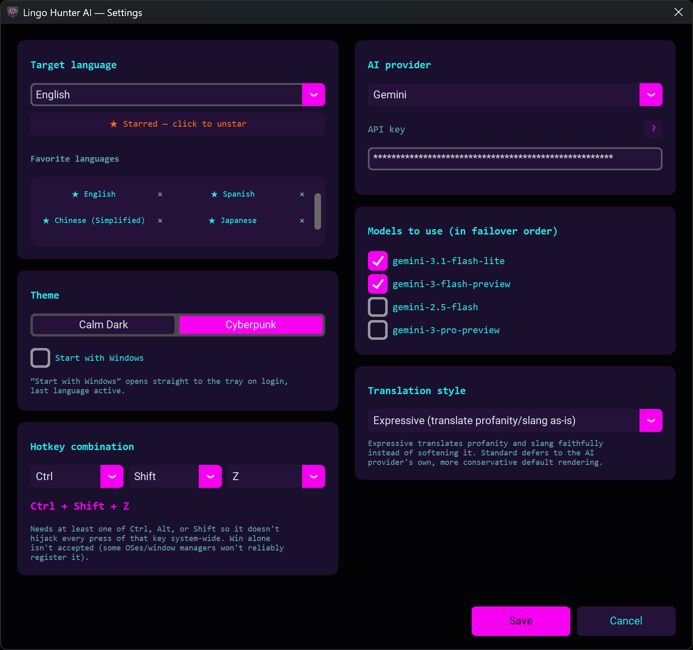

<p align="right">
  <a href="README.md"></a>
  &nbsp;
  <a href="README.ru.md"></a>
</p>

<h1 align="center">
  <br>
  Lingo Hunter AI
</h1>

<p align="center"><b>Type in any language. Hit a hotkey. It's translated — in place, instantly.</b></p>

<p align="center">
<details>
<summary><b>▶️ Watch the demo</b></summary>
<br>

https://github.com/user-attachments/assets/ca662a98-2d5f-4217-9d0c-c2061325597e

</details>
</p>

No browser tab. No copy-paste into a translator and back. No app allow-list. Type your message anywhere — Slack, email, a game chat, a form — press your hotkey (**Ctrl+Shift+Z** by default, fully remappable), and it's translated right there in the same box. Your clipboard is untouched afterward.

<p align="center">
  
  
</p>

## Why it's different

- **Works everywhere** — any focused text field, any app, no restrictions.
- **Never goes down** — five AI providers (Gemini, OpenAI, Anthropic, DeepSeek, OpenRouter) plus local models (Ollama, LM Studio), with automatic failover across your selected models if one is slow, blocked, or unavailable.
- **Says what you meant** — an "Expressive" translation style translates tone, slang, emoji, and profanity as-is instead of the AI provider's usual corporate-safe softening; switch to "Standard" if you'd rather have the conservative default.
- **Simple by default, deep when you want it** — target language (with starrable favorites for quick switching), hotkey, AI provider, and per-provider model failover order are all one panel away, with two built-in themes (Calm Dark, Cyberpunk).
- **Lives in your tray** — closes to the background, one click to bring it back; optional "Start with Windows" launches straight into the tray.

## Quick start

```
pip install -r requirements.txt
python src/main_app.py
```

Prebuilt installers: `python build_exe.py` (Windows) or `python3 build_linux.py` (Linux).

## Platform support

Windows (native global hotkey) and Linux/X11 (hardware-keycode hotkey listener). Wayland-only sessions aren't supported yet — run under XWayland.

## Changelog

### 1.1.0
- **Added OpenRouter as a fifth AI provider.** OpenRouter fronts hundreds of third-party-hosted models, including community fine-tunes (the Cognitive Computations "Dolphin" line ships as the default pool) that don't carry the same content-policy refusals as the flagship providers — useful when Gemini/OpenAI/Anthropic/DeepSeek decline to translate otherwise-legal but crude or explicit text.
- **Fixed over-blocking in Expressive mode.** Gemini's `HARASSMENT` and `SEXUALLY_EXPLICIT` safety thresholds are now fully relaxed (`BLOCK_NONE`) instead of partially relaxed (`BLOCK_ONLY_HIGH`), so ordinary crude or sexually explicit-but-non-hateful text no longer gets silently blocked. Hate speech and dangerous content thresholds are untouched.

### 1.0.0
- Initial release.

## License

Non-commercial. See [license.txt](license.txt).
